# INFORME FINAL DE PROYECTO 
## DESPLIEGUE, ORQUESTACIÓN DISTRIBUIDA, HARDENING E INTEGRACIÓN CONTINUA DE LA PLATAFORMA CTF

**UNIVERSIDAD MAYOR REAL Y PONTIFICIA DE SAN FRANCISCO XAVIER DE CHUQUISACA**  
**Facultad de Tecnología**  
**Asignatura:** Trabajando en la Nube (COM610)  
**Docente:** Ing. Marcelo Quispe Ortega  
**Semestre:** 1/2026  
**Fecha de Entrega Final:** 17 de junio de 2026  

---

*   **Integrantes:**
    1.  **Gabriel Adrian Velasquez Mendia** 
    2.  **Valeria Alexandra Cuellar Coca** 
*   **Repositorio GitHub:** [https://github.com/gabriel-1302/CTF-COM-610.git](https://github.com/gabriel-1302/CTF-COM-610.git)  
*   **Proyecto:** Plataforma Virtual de Entrenamiento y Competencia CTF USFX
---

## I. Matriz de Infraestructura, Servicios y Direccionamiento

El clúster del proyecto está distribuido en dos máquinas virtuales (nodos) de producción dedicadas, alojadas en la infraestructura de la facultad bajo el dominio `rootcode.com.bo`. Esta separación física permite desacoplar los procesos del backend web de los sandboxes de los desafíos, evitando que una denegación de servicio (DoS) en un reto afecte el núcleo del sistema de puntuación.

| Identificador de VM | Componente / Servicio | Tecnología | Dirección IP / Puerto / Endpoint | Estado del Servicio |
| :--- | :--- | :--- | :--- | :--- |
| **VPS 1 (Plataforma)** | Proxy Inverso Host | Nginx | `server-243.rootcode.com.bo:80/443` | **Operativo [VERDE]** |
| **VPS 1 (Plataforma)** | API Gateway Django | Daphne (ASGI Docker) | `127.0.0.1:8000` (Local) | **Operativo [VERDE]** |
| **VPS 1 (Plataforma)** | Daemon de Segundo Plano | Celery (Worker + Beat) | N/A (Docker containerizado) | **Operativo [VERDE]** |
| **VPS 1 (Plataforma)** | Base de Datos Relacional | PostgreSQL 16 | `127.0.0.1:5432` (Docker containerizado) | **Operativo [VERDE]** |
| **VPS 1 (Plataforma)** | Broker de Mensajería / Caché | Redis 7 | `127.0.0.1:6379` (Docker containerizado) | **Operativo [VERDE]** |
| **VPS 1 (Plataforma)** | Socket Docker Local Seguro | `docker-socket-proxy` | `127.0.0.1:2375` (Docker containerizado) | **Operativo [VERDE]** |
| **VPS 1 (Plataforma)** | Telemetría y Dashboards | Prometheus + Loki + Grafana | `server-243.rootcode.com.bo:3000` | **En Configuración [AMARILLO]** |
| **VPS 2 (Desafíos)** | Docker Daemon Remoto | Docker Engine | `192.168.100.244:2375` (Restringido UFW) | **Operativo [VERDE]** |
| **VPS 2 (Desafíos)** | Enrutamiento Dinámico | Nginx (Reglas RegEx) | `server-244.rootcode.com.bo:80` | **Operativo [VERDE]** |
| **VPS 2 (Desafíos)** | Sandbox de Contenedores | Docker Containers | Rango de puertos `32768-60999` | **Operativo [VERDE]** |
| **VPS 2 (Desafíos)** | Agentes de Recolección | Promtail + Node Exporter | `192.168.100.244:9100` (Hacia VPS 1) | **En Configuración [AMARILLO]** |

---

## II. Modelo de Arquitectura Lógica e Interacción de Componentes

La siguiente arquitectura Mermaid detalla el flujo de red verificado, donde las peticiones son procesadas por el Nodo de Control (VPS 1) y los entornos de ejecución interactivos son levantados y destruidos en el Nodo de Desafíos (VPS 2) mediante la llamada remota de API Docker.

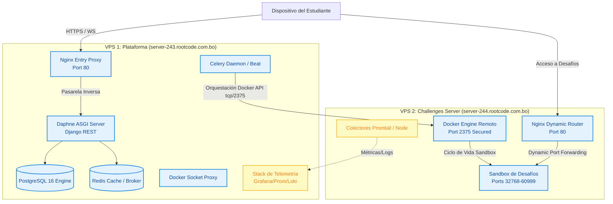

> **Leyenda de Estado:**
> *   **[OPERATIVO] (Celeste/Azul):** Aprovisionado, desplegado, con pruebas de conectividad de red y contenedores validadas en vivo.
> *   **[EN CONFIGURACIÓN] (Amarillo):** Infraestructura básica funcionando; en proceso de pulir filtros de telemetría y recolección de logs locales.

---

## III. Bitácora de Desarrollo e Hitos Técnicos Superados

### Hito 1: Implementación del Asistente de Registro Transaccional (`RegistrationWizard`)
*   **Fecha de Finalización:** 22 de mayo de 2026
*   **Responsable:** Gabriel Adrian Velasquez Mendia
*   **Resumen Técnico:** Creación de la interfaz asistida de inscripción React 19 y transición de la configuración del entorno CTF a base de datos persistente para control dinámico en runtime.
*   **Dificultad Superada:** Originalmente, las operaciones de creación de cuentas y de asignación de equipos ocurrían de forma asíncrona desacoplada, lo que generaba inconsistencias de orfandad si el estudiante no completaba su unión a un equipo. Se programó un Wizard transaccional que empaqueta todo el flujo. Para validar la validez de los códigos de invitación de equipos sin saturar de peticiones PostgreSQL, se implementó un mecanismo de *debounce* de 400ms en el cliente de React, lo que reduce las consultas cruzadas y estabiliza la concurrencia de la API.

### Hito 2: Aprovisionamiento de VMs, Configuración de Firewall y Enlace Seguro de Socket Docker
*   **Fecha de Finalización:** 24 de mayo de 2026
*   **Responsable:** Valeria Alexandra Cuellar Coca
*   **Resumen Técnico:** Apertura y aseguramiento del puerto `2375` en `server-244` para habilitar el control remoto del daemon de Docker desde el Celery worker alojado en `server-243`.
*   **Dificultad Superada:** Exponer el socket de Docker en el puerto TCP `2375` representa un riesgo crítico de seguridad ya que equivale a acceso como *root* en el host de desafíos. Para mitigar este problema sin introducir la sobrecarga de certificados TLS autofirmados inestables durante la fase de desarrollo, se implementó un *hardening* estricto a nivel de red empleando el firewall local `UFW`. Se configuró una directiva restrictiva en el Nodo 2 para denegar cualquier conexión entrante a este puerto exceptuando explícitamente la dirección IP interna del Nodo 1 (`192.168.100.243`), aislando el plano de orquestación de accesos externos no autorizados.

### Hito 3: Solución de Bug de Redirección Dinámica en Nginx mediante Expresiones Regulares
*   **Fecha de Finalización:** 26 de mayo de 2026
*   **Responsables:** Gabriel Adrian Velasquez Mendia y Valeria Alexandra Cuellar Coca
*   **Resumen Técnico:** Implementación de enrutamiento Regex dinámico en Nginx y reescritura de cabeceras de redirección `Location` en la VM 2.
*   **Dificultad Superada:** Los desafíos web lanzaban errores 404 de Nginx debido a que utilizaban rutas absolutas al enviar formularios HTML (ej: `action="/login"`), perdiendo el prefijo del puerto dinámico asignado por Celery (ej: `https://server-244.rootcode.com.bo/32778/login`). Se configuró un Nginx virtual host dinámico en `server-244` mediante la expresión regular `location ~ ^/([0-9]+)/(.*)$` y se inyectaron directivas de reescritura de cabeceras de redirección (`proxy_redirect / /$challenge_port/`), a la vez que se adaptó el código de los desafíos para utilizar rutas relativas (`action="login"`), restableciendo el enrutamiento bidireccional correcto.

### Hito 4: Implementación del Pipeline de Integración Continua (CI/CD con GitHub Actions)
*   **Fecha de Finalización:** 17 de junio de 2026
*   **Responsables:** Gabriel Adrian Velasquez Mendia y Valeria Alexandra Cuellar Coca
*   **Resumen Técnico:** Diseño e implementación de un pipeline de Integración Continua (CI) en GitHub Actions que automatiza la validación de calidad del código en cada `push` o `pull request` contra las ramas `main` y `develop`. El pipeline ejecuta de forma paralela las pruebas del backend (pytest con reporte de cobertura) y el build del frontend (Astro con type-check de TypeScript), y sólo valida el build de las imágenes Docker si ambas etapas anteriores pasan exitosamente.
*   **Dificultad Superada:** Integrar el entorno de testing de Django en un runner de GitHub Actions requirió aislar la configuración de producción. Se creó un módulo de settings separado (`config.settings.testing`) que desactiva las migraciones durante las pruebas (`--nomigrations`) para acelerar la ejecución, y se inyectaron claves ficticias en variables de entorno del job (`DJANGO_SECRET_KEY`, `JWT_SIGNING_KEY`) para evitar que el pipeline dependiera de secretos de producción. Para el build de Docker, se habilitó la caché de capas de imagen entre ejecuciones usando `cache-from/cache-to: type=gha`, reduciendo significativamente el tiempo de construcción en cada corrida.

---

## IV. Cálculo de Recursos y Límites del Sandbox de Contenedores

Para garantizar la concurrencia de **100 estudiantes simultáneos**, se aplicó un diseño de límites de recursos (*Resource Limits*) estrictos a nivel de kernel de Linux (controlado por Docker) en el Nodo de Desafíos (VPS 2):

1.  **Aislamiento y Límites por Contenedor (Challenge):**
    *   **Desafíos Web Ligeros (SQLi, SSTI, LFI, etc.):** Límite de Memoria RAM de `128 MB` y cuota de CPU del `50%` de un núcleo (`cpu_quota=50000` con `cpu_period=100000`).
    *   **Desafío Web Complejo (XSS Stored):** Al requerir un bot headless de Chromium (Puppeteer) para emular la visita del administrador, la memoria se eleva a un límite de `512 MB` (suficiente para la inicialización y el render de la página).
    *   **Límite de PIDs (Procesos):** Restringido a un máximo de `100` procesos concurrentes por contenedor (`pids_limit=100`), previniendo ataques de denegación de servicio por agotamiento de procesos del host (Fork Bombs).

2.  **Capacidad y Escalabilidad del Servidor VPS 2:**
    *   Con un promedio realista de **1.5 contenedores activos por usuario** (ej. 1 reto SQLi de 128MB y 1 reto XSS de 512MB activos en paralelo), el pico máximo estimado es de aproximadamente **105 contenedores concurrentes**.
    *   El requerimiento de memoria RAM neta para los contenedores en pico es de **~27.6 GB**. Gracias al temporizador **TTL de 30 minutos** implementado en Celery Beat y a la limpieza de contenedores huérfanos, la memoria del sistema operativo de 16 GB RAM en VM 2 es capaz de sostener la rotación escalonada de los estudiantes sin saturación.

---

## V. Stack de Observabilidad y Telemetría Centralizada

Para monitorear el comportamiento del clúster multi-nodo y detectar intentos de denegación de servicio o fallos en los desafíos, se ha configurado un entorno de observabilidad integrado en `/home/admin243/ctf-monitoring`:

1.  **Métricas del Sistema (Prometheus):**
    *   Prometheus realiza un raspado (*scraping*) de datos cada 15 segundos (`scrape_interval: 15s`).
    *   Tiene dos objetivos dinámicos configurados: `node-exporter:9100` para las métricas locales de la plataforma (VM 1) y `192.168.100.244:9100` para recopilar el consumo de CPU, memoria y E/S de disco de la máquina de desafíos (VM 2).
2.  **Centralización de Logs (Loki + Promtail):**
    *   Loki se ejecuta en el VPS 1 en el puerto `3100` como motor de almacenamiento e indexación de trazas de logs.
    *   En el VPS 2, se ejecuta un agente de **Promtail** expuesto en el puerto `9080` (configurado en `/home/admin244/ctf-agents/promtail-config.yml`). Este lee localmente los logs de salida estándar de los contenedores Docker efímeros (`/var/lib/docker/containers/*/*-json.log`) y los envía mediante push a Loki (`http://192.168.100.243:3100/loki/api/v1/push`).
3.  **Visualización (Grafana):**
    *   Unifica las fuentes de datos de Loki y Prometheus.
    *   Muestra gráficas del estado del hardware de ambos servidores y permite inspeccionar los payloads inyectados por los estudiantes en los contenedores.
    *   Para mayor seguridad, Nginx en la VM 1 actúa como reverse proxy sirviendo a Grafana en la ruta oculta `/g/graf/` proxeando al puerto `3000` local.

---

## VI. Seguridad, Aislamiento y Buenas Prácticas

El entorno CTF implementa controles estrictos en múltiples capas para garantizar que las vulnerabilidades intencionales de los desafíos no comprometan los sistemas host de producción ni expongan datos sensibles.

1.  **Gestión de Credenciales y Secretos:**
    *   **Inyección Limpia:** No se almacenan credenciales ni claves en texto plano en el repositorio GitHub. Toda la configuración sensible reside en archivos locales `.env` que están explícitamente declarados en el archivo `.gitignore`.
    *   **Integridad de Flags:** Los valores de las banderas no se almacenan como texto legible en la base de datos de PostgreSQL. En su lugar, el sistema guarda únicamente su resumen criptográfico en hash **SHA-256** y realiza la verificación en el submit usando el algoritmo `hmac.compare_digest()` para mitigar ataques de canal lateral (Timing Attacks).

2.  **Protección de Red y Firewall Restrictivo (UFW):**
    *   La política por defecto de ambos nodos es denegar cualquier petición entrante no autorizada (`Default: deny (incoming)`).
    *   El socket del daemon de Docker expuesto en `server-244` (puerto TCP `2375`) y el puerto de Node Exporter (puerto `9100`) están protegidos mediante directivas de UFW, permitiendo la comunicación **únicamente** cuando provienen de la IP interna del Nodo de Control (`192.168.100.243`). Cualquier otro tráfico entrante es descartado (*dropped*).

3.  **Protección Perimetral contra Fuerza Bruta (Fail2ban):**
    *   Fail2ban está activo y en ejecución como servicio del sistema en el host de ambos servidores.
    *   La jaula de seguridad `sshd` está activa para rastrear logs del sistema en busca de intentos fallidos de autenticación, bloqueando de manera automática la IP atacante tras 5 intentos erróneos por un período de 1 hora.

4.  **Aislamiento y Privilegios del Sandbox (Docker Security):**
    *   Los contenedores de los desafíos se ejecutan bajo un usuario no privilegido de Linux denominado `ctf` con UID `1000`, previniendo que una explotación alcance privilegios de *root* en el host.
    *   Se inyecta la directiva de seguridad `no-new-privileges:true` para bloquear llamadas de escalación.
    *   Se remueven todas las capacidades del kernel de Linux usando `cap_drop=["ALL"]`.
    *   Se limita la escritura en disco bloqueando el sistema de archivos a solo-lectura, mapeando únicamente una ruta efímera `/tmp` en memoria RAM (`tmpfs`) limitada a `32MB` para operaciones temporales requeridas por SQLite.

---

## VII. Comandos Operativos y Consola de Administración

### A. Despliegue de los Servicios del Plano de Control (VPS 1 - server-243)
Comandos ejecutados desde la ruta del proyecto en `/home/admin243/ctf-plataform`:

```bash
# Inicializar los servicios principales de la plataforma en segundo plano
docker compose up -d --build

# Visualizar en tiempo real el registro de logs del backend Django
docker compose logs -f backend

# Aplicar las migraciones de esquemas de datos relacionales en PostgreSQL
docker compose exec backend python manage.py migrate

# Popular los datos de configuración iniciales para los 14 retos del CTF
docker compose exec backend python manage.py seed_challenges

# Registrar la cuenta administrativa inicial (superusuario)
docker compose exec backend python manage.py createsuperuser
```

### B. Pruebas de Diagnóstico del Socket Docker Remoto (VPS 1 -> VPS 2)
Comandos para verificar la accesibilidad directa desde la máquina de control hacia el orquestador:

```bash
# Comprobación de estado de escucha de red local en la VM 2
sudo netstat -tlnp | grep 2375

# Consulta al Daemon de Docker remoto desde el backend del VPS 1
docker -H tcp://192.168.100.244:2375 info
```

### C. Configuración del Gateway Nginx y Expresión de Redirección (VPS 2 - server-244)
Comandos aplicados para el aprovisionamiento y recarga en caliente del archivo de enrutamiento dinámico `/etc/nginx/sites-available/ctf-platform`:

```bash
# Validar la sintaxis lógica de las directivas Regex de Nginx
sudo nginx -t

# Recargar el demonio Nginx para aplicar cambios sin caída de servicio
sudo systemctl reload nginx

# Visualizar los contenedores efímeros iniciados activamente en la máquina
watch -n 1 "docker ps"
```

### D. Hardening de Reglas de Cortafuegos (UFW) y Fail2ban
A continuación se detalla la configuración exacta ejecutada en ambos nodos para garantizar la seguridad perimetral del entorno educativo:

**En VPS 1 (Plataforma):**
```bash
sudo ufw default deny incoming
sudo ufw default allow outgoing
sudo ufw allow 22/tcp                      # Acceso SSH de Administración
sudo ufw allow 80,443/tcp                  # Entrada Web de la Plataforma
sudo ufw allow 8080/tcp                    # Entrada alternativa de Proxy
sudo ufw enable
```

**En VPS 2 (Desafíos):**
```bash
# Configurar restricciones por IP origen en UFW
sudo ufw default deny incoming
sudo ufw default allow outgoing
sudo ufw allow 22/tcp                      # Acceso SSH de Administración
sudo ufw allow 80,443/tcp                  # Acceso Web a retos via Proxy Nginx
sudo ufw allow from 192.168.100.243 to any port 2375 proto tcp  # Permite orquestación Docker solo a VPS 1
sudo ufw allow from 192.168.100.243 to any port 9100 proto tcp  # Permite extracción de métricas solo a VPS 1
sudo ufw allow 32768:60999/tcp             # Rango efímero expuesto para conexión de estudiantes
sudo ufw enable

# Verificar estado y bloqueos activos en el servicio de brute-force
sudo fail2ban-client status sshd
```

---

## VIII. Pipeline de Integración Continua (CI/CD — GitHub Actions)

Como parte de las entregas del proyecto final, se implementó un flujo de **Integración Continua** definido en el archivo `.github/workflows/ci.yml` del repositorio, garantizando la integridad del código en cada cambio sobre las ramas principales.

### Arquitectura del Pipeline

El pipeline se activa automáticamente en dos eventos: `push` y `pull_request` sobre las ramas `main` y `develop`. Está compuesto por **tres jobs** con dependencias explícitas:

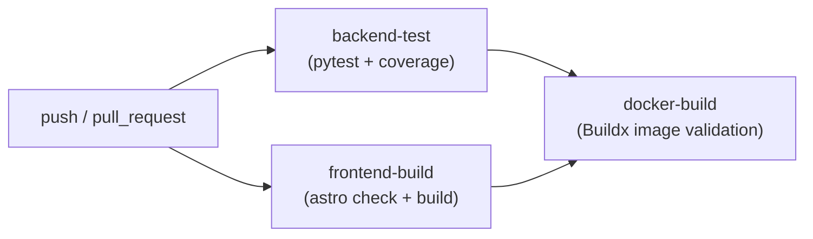

### Job 1: `backend-test` — Pruebas Automatizadas del Backend

| Parámetro | Valor |
| :--- | :--- |
| Runner | `ubuntu-latest` |
| Python | `3.11` |
| Directorio de trabajo | `ctf-platform/backend` |
| Framework de testing | `pytest` con plugin `pytest-cov` |
| Settings de Django | `config.settings.testing` (sin migraciones) |

**Pasos ejecutados:**
1. Checkout del repositorio (`actions/checkout@v4`).
2. Configuración del intérprete Python 3.11 (`actions/setup-python@v5`).
3. Instalación de dependencias desde `requirements.txt`.
4. Ejecución del suite de pruebas con reporte de cobertura en terminal y en formato XML:
    ```bash
    pytest --cov=. --cov-report=term-missing --cov-report=xml \
      --override-ini="addopts=--nomigrations -p no:warnings -v"
    ```
5. Publicación del archivo `coverage.xml` como artefacto del job (`actions/upload-artifact@v4`), disponible incluso si el paso falla (`if: always()`).

### Job 2: `frontend-build` — Build y Verificación de Tipos del Frontend

| Parámetro | Valor |
| :--- | :--- |
| Runner | `ubuntu-latest` |
| Node.js | `22` |
| Directorio de trabajo | `ctf-platform/frontend` |
| Framework | Astro |

**Pasos ejecutados:**
1. Checkout del repositorio.
2. Configuración de Node.js 22 (`actions/setup-node@v4`).
3. Instalación reproducible de dependencias con `npm ci --legacy-peer-deps`.
4. Verificación estática de tipos con `npm run astro -- check` (TypeScript type-checking).
5. Compilación del bundle de producción con `npm run build`.

### Job 3: `docker-build` — Validación de Imágenes Docker

Este job tiene una dependencia explícita: `needs: [backend-test, frontend-build]`. Solo se ejecuta si los dos jobs anteriores finalizaron con éxito, actuando como **gate de calidad** previo a cualquier despliegue.

| Parámetro | Valor |
| :--- | :--- |
| Runner | `ubuntu-latest` |
| Herramienta | Docker Buildx (`docker/setup-buildx-action@v3`) |
| Modo de push | `false` (solo valida el build, no publica) |
| Caché | `type=gha` (caché entre ejecuciones de Actions) |

**Imágenes validadas:**
- `ctf-backend:ci` — construida desde `ctf-platform/backend`.
- `ctf-frontend:ci` — construida desde `ctf-platform/frontend`.

> **Nota de Diseño:** El flag `push: false` garantiza que el pipeline valida el `Dockerfile` de cada componente sin publicar imágenes al registry, lo que permite detectar errores de construcción de forma segura en cualquier rama de desarrollo.

### Variables de Entorno y Secretos del CI

Para que el backend de Django pueda ejecutarse en el entorno de testing sin depender de secretos de producción, se inyectan directamente en el job como variables de entorno con valores ficticios seguros:

```yaml
env:
  DJANGO_SECRET_KEY: ci-secret-key-not-used-in-production-xxxxxxxxxxxxxxxx
  JWT_SIGNING_KEY: ci-jwt-key-not-used-in-production-xxxxxxxxxxxxxxxxxxxxxxx
  DJANGO_SETTINGS_MODULE: config.settings.testing
```

Esto asegura que el módulo `config.settings.testing` se cargue en lugar del de producción, desactivando comportamientos como conexiones a bases de datos externas o el uso de credenciales reales.

---

## IX. Protocolo de Validación del Proyecto Final (Evidencias de Funcionamiento)

De acuerdo con los requisitos técnicos documentados, las evidencias funcionales del entorno y servicios de la Plataforma CTF se consolidan a continuación, describiendo las pruebas operativas implementadas en la arquitectura de dos nodos:

### 1. Configuración de Enrutamiento Dinámico (Proxy Nginx)

**Captura requerida:** Visualización del archivo de configuración de Nginx (`server-243.rootcode.com.bo`) en el nodo de ejecución, demostrando el bloque `location` que captura el puerto dinámico desde la URL para reenviar el tráfico al contenedor correspondiente.

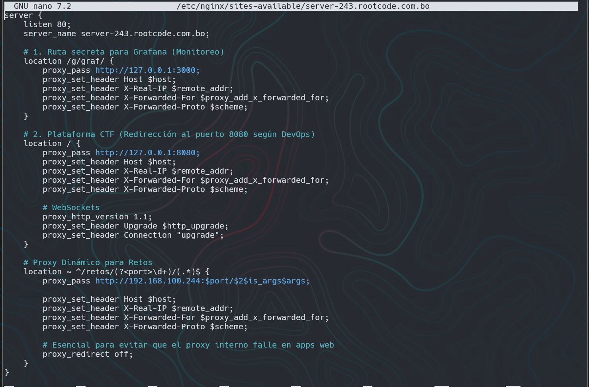

---

### 2. Seguridad Perimetral y Reglas de Firewall (UFW)

**Captura requerida:** Salidas del comando `sudo ufw status` en la VM 1 y la VM 2, evidenciando la política de menor privilegio, como la restricción del puerto `2375` (Docker TCP) exclusivamente para la IP del orquestador.

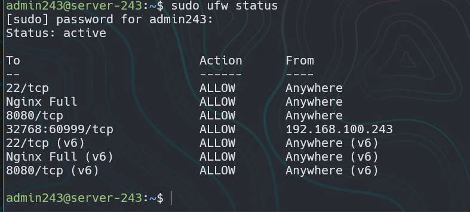
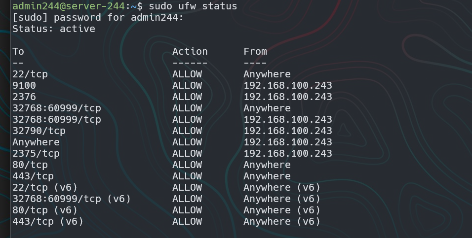

---

### 3. Prevención de Intrusiones (Fail2ban)

**Captura requerida:** Ejecución de `sudo fail2ban-client status` en ambos servidores, confirmando la activación de los *jails* de protección (como `sshd`) contra ataques de fuerza bruta.

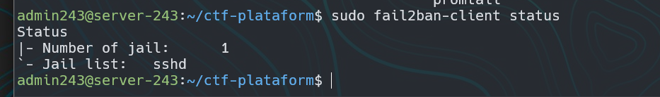
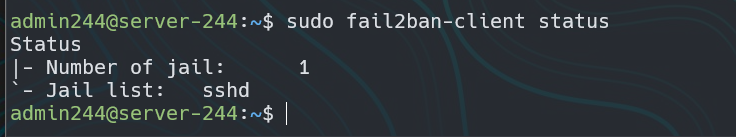
---

### 4. Conectividad TCP Remota del Orquestador Docker

**Captura requerida:** Terminal mostrando la ejecución exitosa del siguiente comando desde la VM 1, confirmando el control del daemon remoto sin cifrado TLS en la red interna:

```bash
docker -H tcp://192.168.100.244:2375 info | grep "Server Version"
```

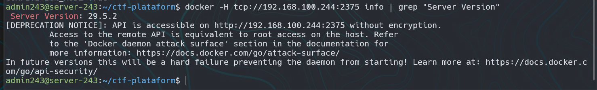

---

### 5. Aprovisionamiento de Contenedores de Retos — Prueba A

**Captura requerida:** Terminal de la VM 2 ejecutando `docker ps` que muestre el contenedor del reto CTF (junto con los servicios de plataforma) en estado `Up` y certifique el mapeo dinámico de puertos.

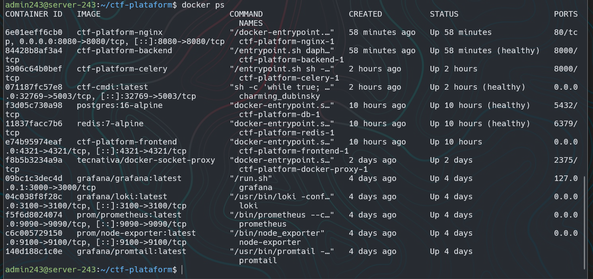

---

### 6. Interfaz de Plataforma y Generación de URLs — Prueba B

**Captura requerida:** Pantalla de la plataforma CTF mostrando el reto activado y el botón **"Acceder al Reto"**, validando que el backend construye correctamente la URL dinámica utilizando el puerto asignado (ej. `https://server-244.rootcode.com.bo/32789/`).

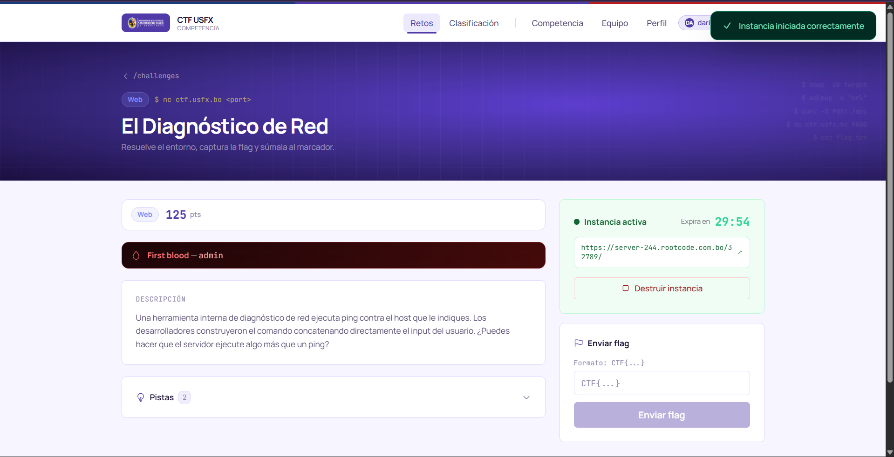

---

### 7. Prueba de Concepto End-to-End — Prueba C

**Captura requerida:** Reto CTF (ej. *NetDiag*) completamente cargado y funcional en el navegador bajo la URL dinámica asignada a la VM 2, confirmando que la cadena de orquestación, ejecución y enrutamiento opera de extremo a extremo.

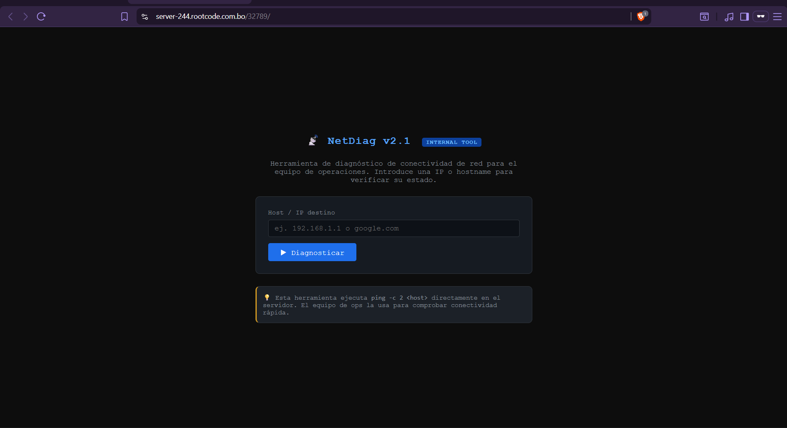

---

### 8. Métricas de Observabilidad y Monitoreo

**Captura requerida:** Dashboards del stack de monitoreo, incluyendo la interfaz de Grafana con los paneles de Node Exporter (consumo de recursos) y la consola de Loki para la exploración de logs de los contenedores mediante LogQL.

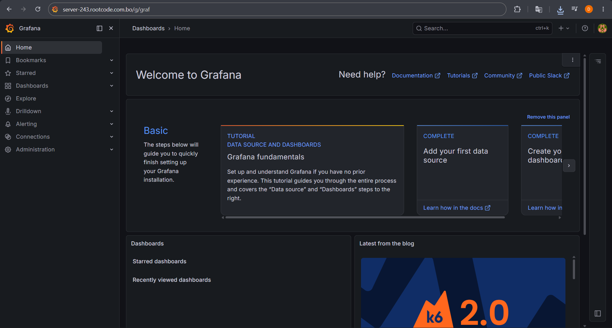
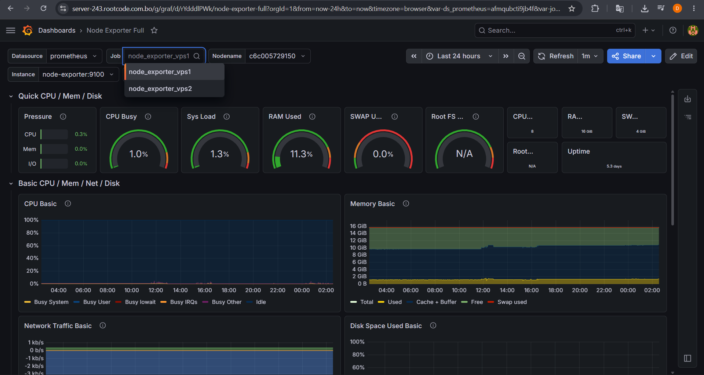
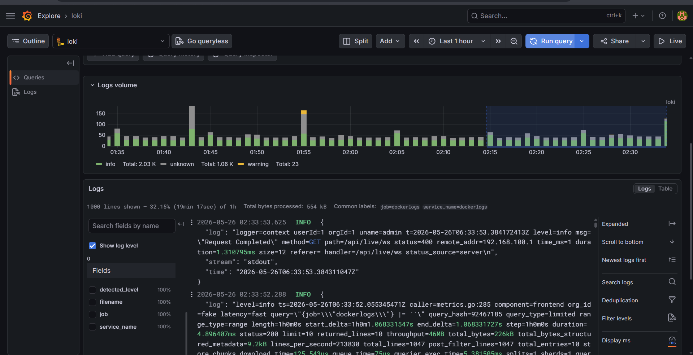
